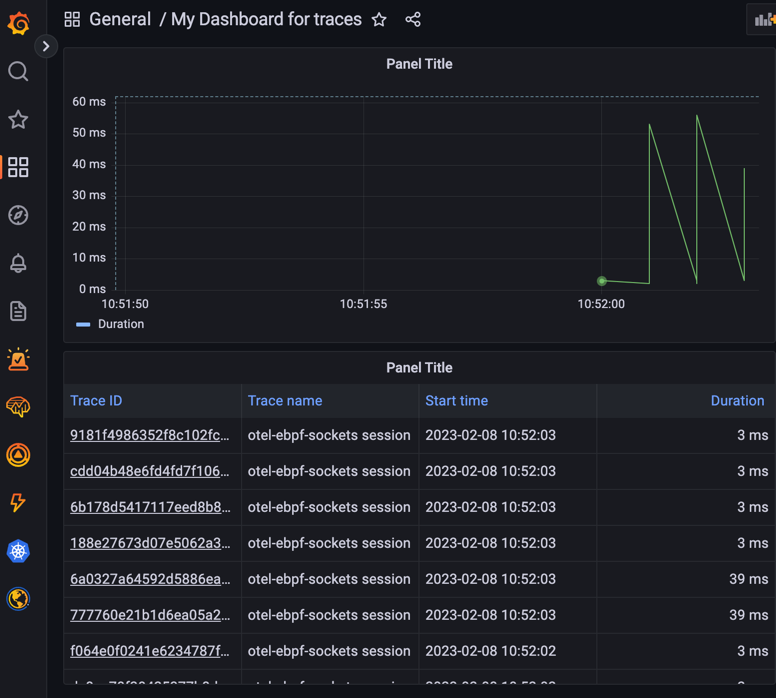

# ebpf-template

Golang eBPF project template.

⚠️ Disclaimer ⚠️ this is just a toy exampled aimed at evaluating the integration of eBPF --> Grafana Agent --> Grafana.
It doesn't provide really meaningful information and might generate a lot of traces
(eBPF --> Agent trace submissions are actually captured, generating more traces).

It is based on the project structure from https://github.com/netobserv/netobserv-ebpf-agent

## How to run

### K8s

The example here can be run in any host with administrative permissions but we provide two deployment files
for a quick and simple example deployment:

1. Copy the [deployments/01-example-k8s-agentconfig.yml.template](./deployments/01-example-k8s-agentconfig.yml.template)
   file locally and edit it to provide your traces cloud name, endpoints and authentication.
   ```
   $ cp deployments/01-example-k8s-agentconfig.yml.template deployments/01-example-k8s-agentconfig.yml
   ```
2. Deploy the manifests in the [deployments/](./deployments) folders.
   ```
   kubectl apply -f deployments/01-example-k8s-agentconfig.yml
   kubectl apply -f deployments/02-example-k8s.yml
   ```
   
You should be able to query traces in your Grafana board.



### Host Native

1. Deploy the [Grafana Agent](https://grafana.com/docs/grafana-cloud/data-configuration/agent/) and setup a traces'
   OLTP receiver using HTTP.
2. Compile the main executable:
   ```
   make compile
   ```
3. As an administrator, run it by setting the `OTEL_TRACES_ENDPOINT` environment variable to the Agent collector.
   ```
   export OTEL_TRACES_ENDPOINT="localhost:4321"
   bin/main
   ``` 

## Development recipes

### How to regenerate the eBPF Kernel binaries

The eBPF program is embedded into the `pkg/ebpf/bpf_*` generated files.
This step is generally not needed unless you change the C code in the `bpf` folder.

If you have Docker installed, you just need to run:

```
make docker-generate
```

If you can't install docker, you should locally install the following required packages:

```
dnf install -y kernel-devel make llvm clang glibc-devel.i686
make generate
```

Tested in Fedora 35, 38 and Red Hat Enterprise Linux 8.
